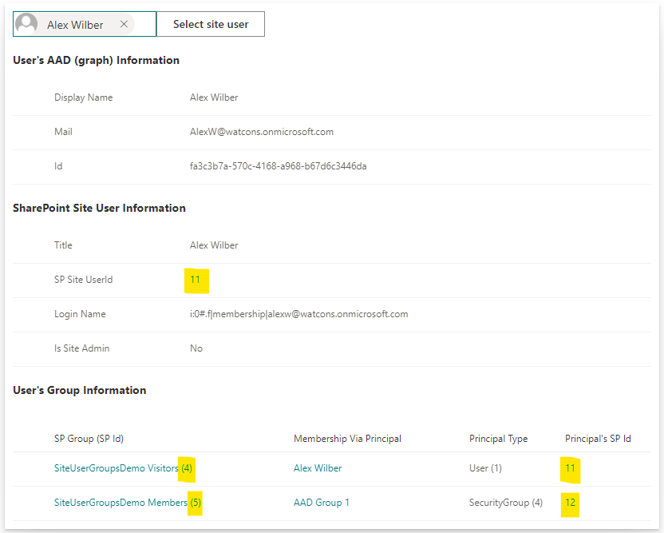
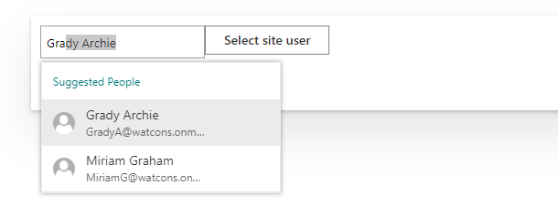
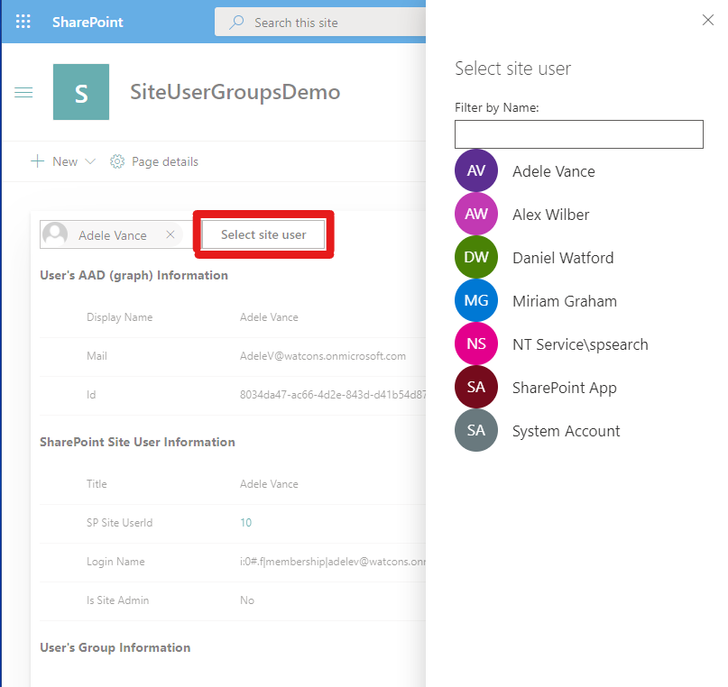

# user-group-info

## Summary

Web Part that displays SharePoint user ids for the current user and any Active AD groups they are a member of which are known to the SharePoint site.

## Used SharePoint Framework Version

## Applies to

- [SharePoint Framework](https://aka.ms/spfx)
- [Microsoft 365 tenant](https://docs.microsoft.com/en-us/sharepoint/dev/spfx/set-up-your-developer-tenant)

> Get your own free development tenant by subscribing to [Microsoft 365 developer program](http://aka.ms/o365devprogram)

## Prerequisites

Access to a SharePoint online site with various users granted access to various resources directory, via AAD groups and via SharePoint groups.

## Solution

| Solution      | Author(s)                                                                                               |
| ------------- | ------------------------------------------------------------------------------------------------------- |
| UserGroupInfo | Daniel Watford (https://twitter.com/DanWatford), Watford Consulting Ltd (https://watfordconsulting.com) |

## Version history

| Version | Date              | Comments        |
| ------- | ----------------- | --------------- |
| 0.0.1   | September 2, 2020 | Initial release |

## Disclaimer

**THIS CODE IS PROVIDED _AS IS_ WITHOUT WARRANTY OF ANY KIND, EITHER EXPRESS OR IMPLIED, INCLUDING ANY IMPLIED WARRANTIES OF FITNESS FOR A PARTICULAR PURPOSE, MERCHANTABILITY, OR NON-INFRINGEMENT.**

---

## Minimal Path to Awesome

- Clone this repository
- Ensure that you are at the solution folder
- in the command-line run:
  - **npm install**
  - **gulp trust-dev-cert**
  - **gulp serve --nobrowser**
- Open the hosted workbench on a SharePoint site - i.e. https://_tenant_.sharepoint.com/site/_sitename_/_layouts/workbench.aspx
- Add the User and Group Info webpart to the page.
- View the current user's information and the 'user' information for any Azure AD groups the user belongs to which are also known to the SharePoint site.

## Features

This webpart was created to better understand the relationship between AAD users, AAD groups, SP User and SP Groups.

Experiment by granting permissions directly to some users for a site, directly to an AAD group for a site, and to a SP group where the membership consists of the AAD user or nested AAD groups.

This webpart was created to help understand the Id values that are read from a Person column in a List View Command Set extensions.

## Display current user's membership of AAD and SP groups

Note the highlighted SP User Ids.

## SharePoint Group Display

To view details of a SharePoint user (which appears to include synchronised AAD groups) or a SharePoint group visit https://_tenant_.sharepoint.com/site/_sitename_/_layouts/userdisp.aspx?ID=20, altering the ID value to match one of the SP Ids displayed by the webpart.

When visiting the URL you will likely be redirected one of the following types of views:

- Details of a SharePoint group with a list of group members.
- Details of a SharePoint user which represents an AAD group.
- Delve view of the SharePoint user's profile.

In the following screenshop the highlighted SP Group Id in the URL corresponds to the X Approvers group Id shown in the webpart.

The next screenshop shows the SharePoint User Information view which corresponds to an AAD group.

## References

- [User profile synchronization](https://docs.microsoft.com/en-us/sharepoint/user-profile-sync)
